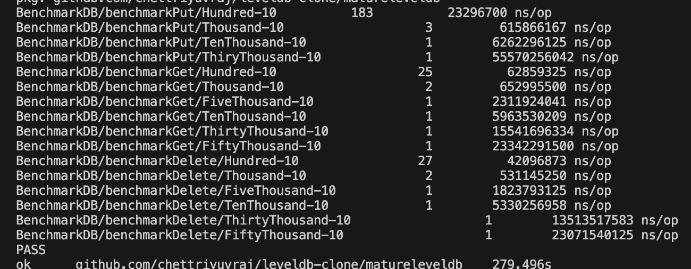

# README

This is a directory to test the goleveldb package - e.g. creating db and examining files, running goleveldb against the test suite / benchmarks created for our implementation, etc


## Benchmarks

- goleveldb performance on benchmarks relative to my implementation(s) (refer to sample_test.go)
    - naive implementation
        
    - skip list implementation
        
    - goleveldb
        


## File Format

### .log file

- The .log format for goleveldb holds true to [what is described in leveldb's official docs](https://github.com/google/leveldb/blob/main/doc/log_format.md), however there are a few things to note

- For reference, this is the format for each record in .log file:
    ```
        block := record* trailer?
    record :=
    checksum: uint32     // crc32c of type and data[] ; little-endian
    length: uint16       // little-endian
    type: uint8          // One of FULL, FIRST, MIDDLE, LAST
    data: uint8[length]
    ```

- Using the function _testDBWithLittleData_ to generate the .log file, we examine it as follows:
    - The first 4 bytes are checksum: _8c 5b_
    - Next 2 bytes represents the length in little-endian: _1b 00_ to be read as _00 1b_ = 27 bytes
    - Next 1 byte is the type: _01_ which is full
    - Since the length is 27 bytes, the next 27 bytes equals the data: If you count 27 bytes, they will end exactly at the last byte of _trash:dustbin_
    - Note: There are a lot of empty blocks in the 27 bytes of data, this is what surprised me. I am not sure if leveldb does the exact same thing.
    



- TODO: the docs mention a certain _recordio_ format, what is that?
