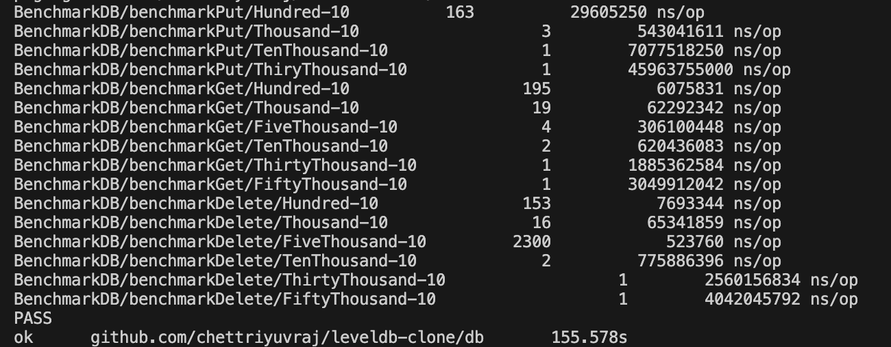
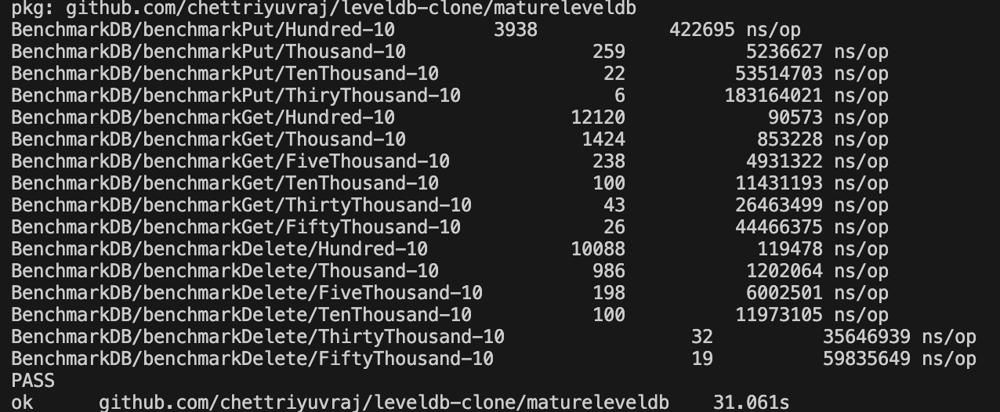
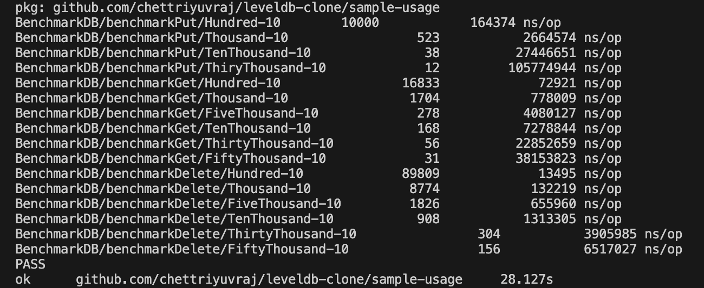

# README

This is a directory to test the goleveldb package - e.g. creating db and examining files, running goleveldb against the test suite / benchmarks created for our implementation, etc

## Benchmarks

- goleveldb performance on benchmarks relative to my implementation(s) (refer to sample_test.go)
    - naive implementation
        
    - skip list implementation
        
    - goleveldb
        

